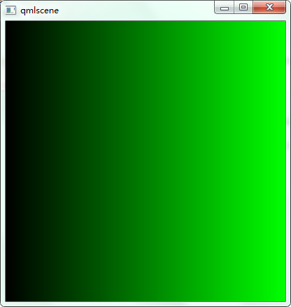
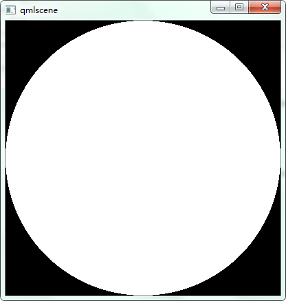
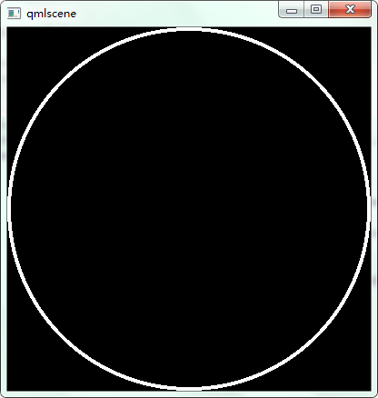
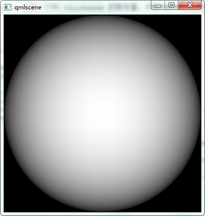

# GLSL.qml

Tell you how to use glsl in qml type ShaderEffect.

qml中的glsl学习。

> 注意：直接对 Item 的 `layer.effect` 设置着色器时，要设置 `layer.enabled: true`。

## 线性渐变

```qml
import QtQuick 2.0

ShaderEffect {
    id: root
    width: 400
    height: 400

    //![1]
    property size uResolution: Qt.size(root.width, root.height)
    //![1]
    fragmentShader: "
            uniform vec2 uResolution;
            void main() {
                vec2 position = gl_FragCoord.xy/uResolution;
                float gradient = position.x;
                gl_FragColor = vec4(0., gradient, 0., 1.);
            }"
}
```

效果如下：



进阶：

```
import QtQuick 2.0

ShaderEffect {
    id: root
    width: 400
    height: 400

    property real value: 0
    NumberAnimation on value {
        duration: 2500
        from: 0
        to: 3
        loops: Animation.Infinite
    }

    //![1]
    property size uResolution: Qt.size(root.width, root.height)
    //![1]

    //![2]
    // gl_FragCoord 这个片段独有的变量存放了当前片段相对窗口的坐标。
    // 这个值是从顶点生成片段之后对图元进行固定函数插值的结果
    // 你可以通过除法 gl_FragCoord.xy/uResolution 来把你的像素坐标转化到 0.0 ≤ xy ≤ 1.0 这个范围
    // 这在很多时候能大大简化像素着色器的计算。
    // 这也是 gl_FragColor 的绝佳取值范围，现在让我们来看一些渐变！
    fragmentShader:"
            uniform vec2 uResolution;
            uniform float value;
            void main() {
                vec2 position = gl_FragCoord.xy/uResolution;
                float gradient = (position.x+position.y)/value;
                gl_FragColor = vec4(0., gradient, 0., 1.);
            }"
    // 通过修改 float gradient = position.x; 横向
    // 通过修改 float gradient = position.y; 竖向
    // float gradient = (position.x+position.y)/2.; 斜向
    //![2]

}
```

## 2D 圆盘

```
import QtQuick 2.0

ShaderEffect {
    id: root
    width: 400
    height: 400
    property size uResolution: Qt.size(root.width, root.height)

    fragmentShader:"
            uniform vec2 uResolution;
            void main() {
                vec2 center = vec2(uResolution.x/2., uResolution.y/2.);

                // 2
                float radius = uResolution.x/2.;

                // 3
                vec2 position = gl_FragCoord.xy - center;

                // 4
                if (length(position) > radius) {
                  gl_FragColor = vec4(vec3(0.), 1.);
                } else {
                  gl_FragColor = vec4(vec3(1.), 1.);
                }
            }"
}
```



1. 圆盘的 center 会处于你屏幕的正中央。

2. 圆盘的 radius 会是你屏幕宽度的一半。

3. position 是当前像素的坐标相对圆盘圆心的偏移值。可以想象成是一个向量从圆盘圆心指向当前位置。

4. length() 用于计算向量长度，在这个例子里长度是根据勾股定理 √(position.x²+position.y²) 来计算的。

    A.如果结果比 radius 大，说明当前像素在圆盘区域外，那么就染成黑色。

    B.否则，说明当前像素在圆盘区域内，染成白色。

作为对这个行为的补充说明，可以参看 圆形方程 (x-a)²+(y-b)² = r² 。注意 r 是半径， ab 是圆心，而 xy 是圆上所有点集。

圆盘是平面上被圆形围住的一块区域，上面的 if-else 语句会准确的把它画出来！

## 细圆环

```qml
import QtQuick 2.0

ShaderEffect {
    id: root
    width: 400
    height: 400
    smooth: true
    property size uResolution: Qt.size(root.width, root.height)
    fragmentShader:"
            uniform vec2 uResolution;
            void main() {
                vec2 center = vec2(uResolution.x/2., uResolution.y/2.);
                float radius = uResolution.x/2.;
                vec2 position = gl_FragCoord.xy - center;
                float thickness = radius/50.;

                if ((length(position) > radius) || (length(position) < radius-thickness)) {
                    gl_FragColor = vec4(vec3(0.), 1.);
                } else {
                    gl_FragColor = vec4(vec3(1.), 1.);
                }
            }"
}
```



> 试着根据 radius 创建一个叫 thickness 的新变量，并在 if-else 条件中使用。

## 3D球体

```
import QtQuick 2.0

ShaderEffect {
    id: root
    width: 400
    height: 400
    smooth: true
    property size uResolution: Qt.size(root.width, root.height)
    fragmentShader:"
            uniform vec2 uResolution;
            void main() {
                vec2 center = vec2(uResolution.x/2., uResolution.y/2.);
                float radius = uResolution.x/2.;
                vec2 position = gl_FragCoord.xy - center;
                float thickness = radius/50.;
                float z = sqrt(radius*radius - position.x*position.x - position.y*position.y);
                z /= radius;
                gl_FragColor = vec4(vec3(z), 1.);
            }"
}
```



---

[为新手准备的 Codea 着色器（Shader）教程](http://my.oschina.net/freeblues/blog/336055)

[OpenGL ES像素着色器教程](http://www.tuicool.com/articles/VFnAFbB)
