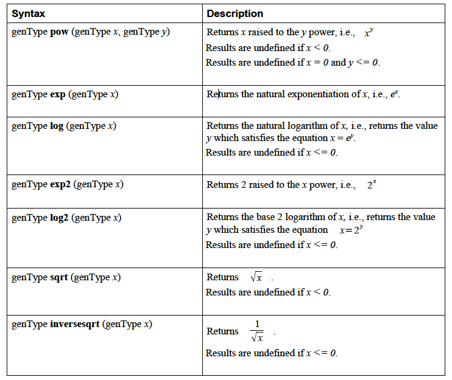
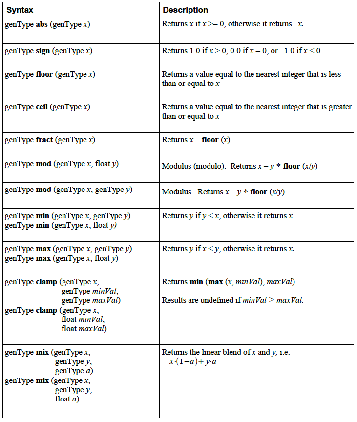
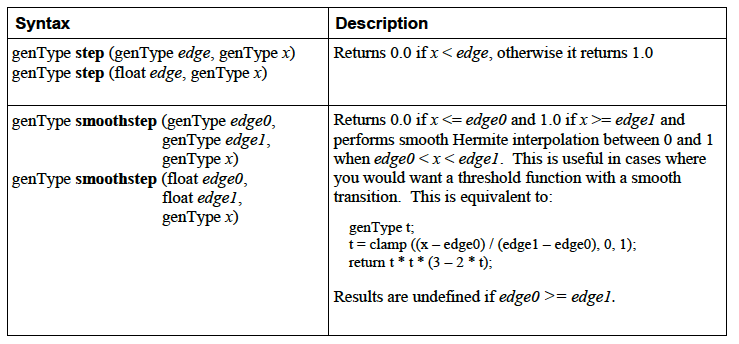
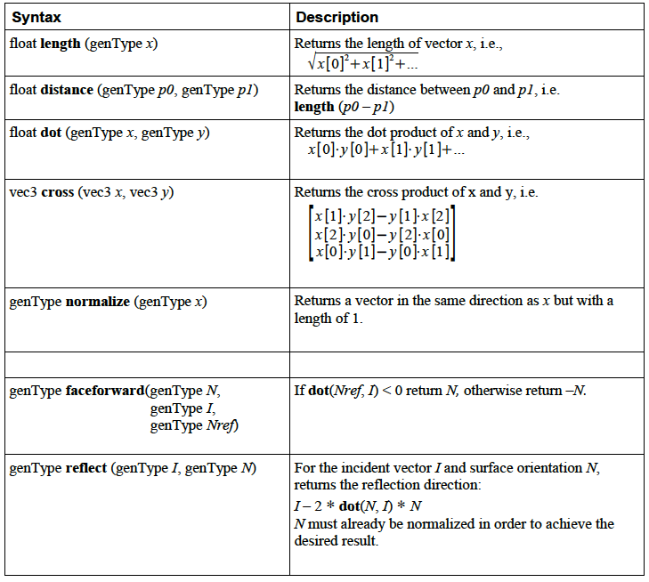
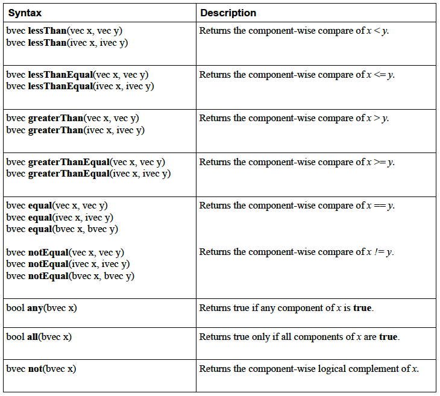
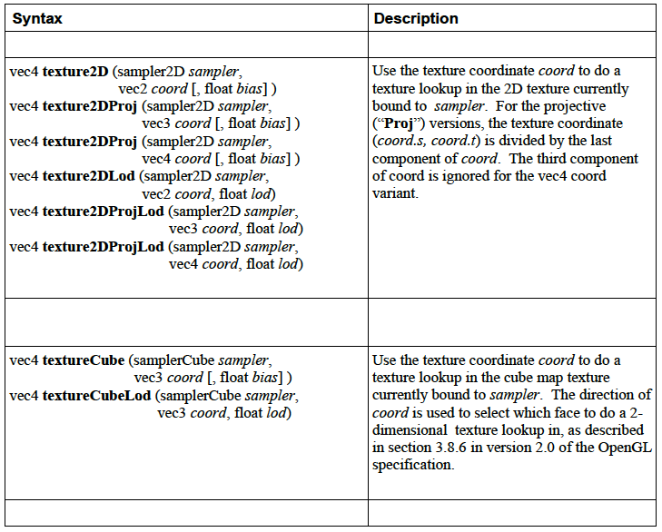

# GLSL 内建函数

GLSL 为标量和向量操作定义了一套内建便利函数。有些内建函数可以用在多个类型的着色器中，有些是针对固定硬件的，所以这部分只能用在某个特定的着色器上。

内建函数基本上可以分为一下三类：

1. 它们使用一些简便的方式提供必要的硬件功能，如材质贴图。这些函数单独通过着色器是无法模拟出来的。

2. 它们展示了一些可以常简单的写入的繁琐操作（clamp，mix等），但是这些操作非常普遍，并且提供直接对硬件的支持。对于编译器来说，将表达式映射到复杂的装配线指令上是非常困难的。

3. 它们提供了对图形硬件的操作，并且在适当时候进行加速。三角函数就是一个很好的例子。

有些函数名称和常见的 C 库函数类似，但是它们支持向量的输入和更多的传统标量输入。

建议应用程序尽量使用内建函数而不是在着色器中实现相同的计算，因为内建函数是经过最大优化的（如，有些内建函数是直接操作硬件的）。

用户定义的代码可以重载内建函数，但最好不要重新定义它们。

内建函数的输入参数（和相应的输出的参数）可以是 `float`，`vec2`，`vec3`，`vec4`。对于函数的任何特定应用，实际的类型必须和所有的参数和返回值相同。就像 `mat`，必须为 `mat2`，`mat3`，`mat4`。

参数和返回值的精度修饰符是隐藏的，对于材质函数，返回类型的精度必须和采样器类型匹配。

```
uniform lowp sampler2D sampler;
highp vec2 coord;
...
lowp vec4 col = texture2D (sampler, coord); // texture2D 返回类型的精度为lowp
```

其他内建函数形参的精度修饰是没有任何关联的。内建函数的调用将返回输入参数的最高精度。

## 角度和三角函数

标识为 angle 的函数参数假定以弧度为单位。这些函数不可能出现被 0 除的情况，如果被除数为 0，结果是未定义的。


`radian` 函数是将角度转换为弧度，`degrees` 函数是将弧度转换为角度。`sin`，`cos`，`tan` 都是标准的三角函数。`asin`，`acos`，`atan` 是反三角函数。`genType` 有点像面向对象中泛型，即如果 `genType` 是 `float` 型的，那么

```
genType pow (genType x, genType y)
```

就变成了：

```
float pow (float x, float y)
```

同理，如果 `genType` 是 `int` 型的，那么就变成了：

```
int pow (int x, int y)；
```

## 指数函数



1. `x` 的 `y` 次方。如果 `x` 小于 `0`，结果是未定义的。同样，如果 `x=0` 并且 `y<=0`，结果也是未定义的。使用时应特别注意。

    ```
    genType pow (genType x, genType y)
    ```       

2. `e` 的 `x` 次方。

    ```
    genType exp (genType x)
    ```

3. 计算满足 `x` 等于 `e` 的 `y` 次方的 `y` 的值。如果 `x` 的值小于 `0`，结果是未定义的。

    ```
    genType log (genType x)
    ``` 

4. 计算 `2` 的 `x` 次方。

    ```
    genType exp2 (genType x)
    ```

5. 计算满足 `x` 等于 `2` 的 `y` 次方的 `y` 的值。如果 `x` 的值小于 `0`，结果是未定义的。

    ```
    genType log2 (genType x)
    ```

6.  计算 `x` 的开方。如果 `x` 小于 `0`，结果是未定义的。

    ```
    genType sqrt (genType x)
    ```

7. 计算 `x` 的开方之一的值，如果 `x` 小于等于 `0`，结果是未定义的。

    ```
    genType inversesqrt (genType x)
    ```

## 常用函数





1. 返回 x 的绝对值。

    ```
    genType abs (genType x)
    ```

2. 如果 `x>0`，返回 `1.0`。如果 `x=0`，返回 `0`，如果` x<0`，返回 `-1.0`。

    ```
    genType sign (genType x)
    ```

3. 返回小于等于 `x` 的最大整数值。

    ```
    genType floor (genType x)
    ```

4. 返回大于等于 `x` 的最小整数值。

    ```
    genType ceil (genType x)
    ```

5. 返回 `x-floor(x)`，即返回 `x` 的小数部分。

    ```
    genType fract (genType x)
    ```

6. 返回 `x – y * floor (x/y)`，即求模计算 `%`。

    ```
    genType mod (genType x, float y)
    
    genType mod (genType x, genType y)
    ```

7. 返回 `x` 和 `y` 的值较小的那个值。

    ```
    genType min (genType x, genType y)
    
    genType min (genType x, float y)
    ```

8. 返回 `x` 和 `y` 的值较大的那个值。

    ```
    genType max (genType x, genType y)
    
    genType max (genType x, float y)
    ```

9. `clamp` 翻译为夹具，就叫夹具函数。获取 `x` 和 `minVal` 之间较大的那个值，然后再拿较大的那个值和最后那个最大的值进行比较然后获取较小的那个，意思就明白了，`clamp` 实际上是获得三个参数中大小处在中间的那个值。

    函数有个说明：如果 `minVal > minMax` 的话，函数返回的结果是未定的。也就是说x的值大小没有限制，但是 `minval` 的值必须比`maxVal` 小。

    ```
    genType clamp (genType x, genType minVal, genType maxVal)
    
    genType clamp (genType x, float minVal, float maxVal)
    ```

10. 返回线性混合的 `x` 和 `y`，如：`x⋅(1−a)+y⋅a`。

    ```
    genType mix (genType x, genType y, genType a)
    
    genType mix (genType x, genType y, float a)
    ```

11. 如果 `x < edge`，返回 `0.0`，否则返回 `1.0`。

    ```
    genType step (genType edge, genType x)
    
    genType step (float edge, genType x)
    ```

123. 如果 `x <= edge0`，返回 `0.0`。如果 `x >= edge1` 返回 `1.0`。如果 `edge0 < x < edge1`，则执行 0~1 之间的平滑埃尔米特差值。如果 `edge0 >= edge1`，结果是未定义的。

    ```
    genType smoothstep (genType edge0,genType edge1,genType x)
    
    genType smoothstep (float edge0,float edge1,genType x)
    ```

## 几何函数



1. 返回向量 `x` 的长度。

    ```
    float length (genType x)
    ```

2. 计算向量 `p0`，`p1` 之间的距离。

    ```
    float distance (genType p0, genType p1)
    ```

3. 向量 `x`，`y` 之间的点积。

    ```
    float dot (genType x, genType y)
    ```

4. 向量 `x`，`y` 之间的叉积。

    ```
    vec3 cross (vec3 x, vec3 y)
    ```

5. 标准化向量，返回一个方向和 `x` 相同但长度为 `1` 的向量。

    ```
    genType normalize (genType x)
    ```

6. 如果 `Nref` 和I的点积小于 0，返回 `N`。否则，返回 `-N`。

    ```
    genType faceforward(genType N, genType I, genType Nref)
    ```

7. 返回反射向量。

    ```
    genType reflect (genType I, genType N)
    ```

8. 返回折射向量。

    ```
    genType refract(genType I, genType N,float eta)
    ```

## 矩阵函数


1. 矩阵 `x` 乘以 `y`，`result[i][j]`是 `x[i][j]` 和` y[i][j]` 的标量积。注意，要获取线性代数矩阵的乘法，使用乘法操作符 `*`。

```
mat matrixCompMult (mat x, mat y)
```

## 向量相关函数

相关或相等的操作符 `<`，`<=`，`>`，`>=`，`==`，`!=` 被定义（或保留），返回一个标量布尔值。下面，`bvec` 是表示 `bvec2`， `bvec3`，`bvec4` 的占位符，`ivec` 是 `ivec2`，`ivec3`，`ivec4` 的占位符，`vec` 是 `vec2`，`vec3`，`vec4` 的占位符。在任何情况下，输入和返回值向量的长度必须匹配。


   
1. 比较 `x < y`。

    ```
    lessThan
    ```

2. 比较` x<=y`。

    ```
    lessThanEqual
    ```

3. 比较 `x > y`。

    ```
    greaterThan
    ```

4. 比较 `x >= y`。

    ```
    greaterThanEqual
    ```

5. 比较 `x == y`。

    ```
    equal
    ```

6. 比较 `x != y`。

    ```
    notEqual
    ```

7. 如果向量 `x` 的任何组件为 `true`，则结果返回 `true`。

    ```
    bool any(bvec x)
    ```

8. 如果向量x的所有组件均为 `true`，则结果返回 `true`。

    ```
    bool all(bvec x)
    ```

9. 返回向量 `x` 的互补矩阵。

    ```
    bvec not(bvec x)
    ```

## 材质查找函数

纹理（材质）查找函数对于定点着色器和片元着色器都适用。然而，定点着色器的细节级别并不是通过固定功能计算的，所以顶点着色器和片元着色器纹理查找之间还是有一些差别的。一下函数是通过采样器访问纹理，和使用 OpenGL ES API 是一样的。纹理属性如尺寸，像素格式，维数，过滤方法，纹理映射匹配数，深度比较等等在 OpenGL ES API 中都有定义。

在下面的函数中，`bias` 参数对于片元着色器来说是可选的。但在定点着色器中不可使用。对于片元着色器，如果使用了 `bias` 这个参数，它被加到优先细节的计算级别中来执行纹理访问操作。如果 `bias` 没有使用，那么实现将自动选择一个默认级别。对于非纹理映射的纹理，纹理是直接被使用的。如果是纹理映射的，并且在片元着色器中执行，那么使用 `LOD` 来进行纹理查找。如果是纹理映射的，并且在顶点着色器中执行，那么使用的是基本纹理。

以 `LOD` 结尾的内建函数只能用在顶点着色器中，在带有 `LOD` 的函数中，`LOD` 参数直接用来表示细节级别。



## 片元处理函数

片元处理函数只有在片元语言中才有，但在 GLSL ES 中没有片元处理函数。

> es2.0 有片元处理器。fragment shader，也叫 pixel shader。

---

[GLSL 内建函数](http://blog.csdn.net/hgl868/article/details/7876257)
