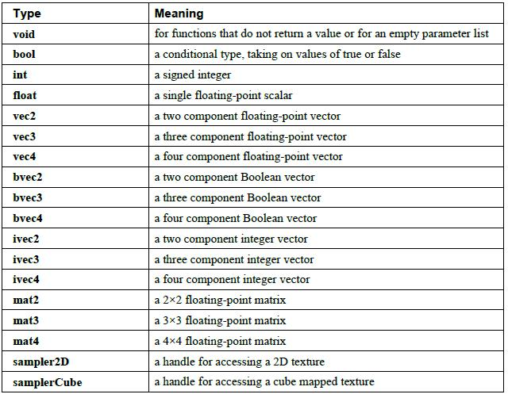
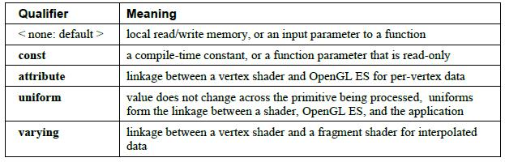
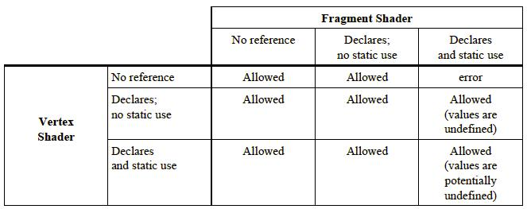
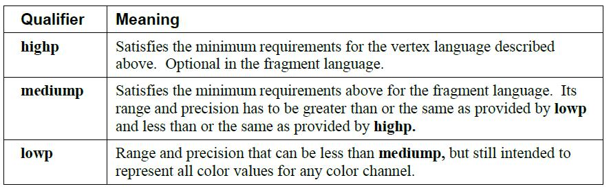
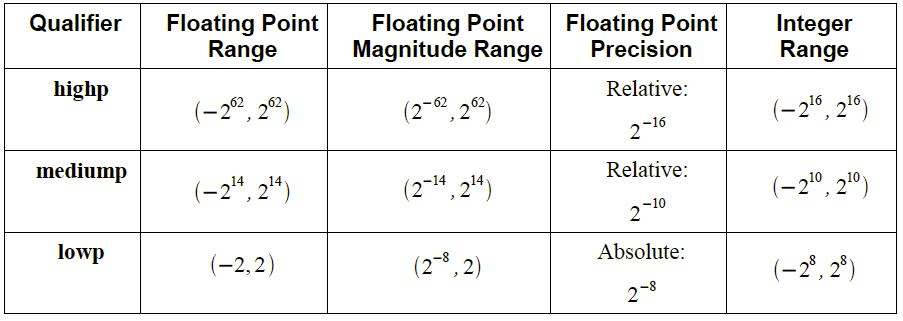

# GLSL 变量与数据类

和大多数编程语言一样，GLSL 也是有变量与数据类型的。所有变量和函数在使用前必须声明。变量和函数名是标识符。

> 和 c 语言同出一辙，竟然有预处理。

没有默认类型，所有变量和函数声明必须包含一个声明类型以及可选的修饰符。变量在声明的时候首先要标明类型，后边可以跟多个变量，之间用逗号隔开。很多情况下，变量在声明的时候可以使用等号 `=` 进行初始化。

用户定义类型可以使用 `struct`，在结构体中所有变量类型都必须是 GLSL 定义的关键字。GLSL 是类型安全的，因此不支持**隐式类型转换**。

## 基本数据类型



### void

函数没有返回值必须声明为 `void`，没有默认的函数返回值。关键字 `void` 不能用于其他声明，除了空形参列表外。

### Booleans

布尔值，只有两个取值 `true` 或 `false`。

```
bool success, done = false;
```

### Integers

整型主要作为编程的援助角色。在硬件级别上，真正地整数帮助有效的实现循环和数组索引，纹理单元索引。然而，GLSL 没必要将整型数映射到硬件级别的整数。我们并不赞成底层硬件充分支持范围广泛的整数操作。GLSL 会把整数转化成浮点数进行操作。整型数可以使用十进制（非0开头数字），八进制（0开头数组）和十六进制表示（0x开头数字）。

```
int i, j = 42;
```

### Floats

浮点型用于广泛的标量计算。可以如下定义一个浮点数：

```
float a, b = 1.5;
```

### Vectors

GLSL 包含像 2-，3-， 4- 浮点数、整数、booleans 型向量的泛型表示法。浮点型向量可以保存各种有用的图形数据，如颜色，位置，纹理坐标。

```
vec2 texCoord1, texCoord2;
vec3 position;
vec4 rgba;
ivec2 textureLookup;
bvec3 lessThan;
```

向量的初始化工作可以放在构造函数中完成。

### Matrices

矩阵是另一个在计算机图形中非常有用的数据类型，GLSL 支持 2x2，3x3，4x4 浮点数矩阵。

```
mat2 mat2D;
mat3 optMatrix;
mat4 view, projection;
```

矩阵的初始化工作可以放在构造函数中完成。

### Sampler

采样器类型（如 sampler2D ）实际上是纹理的不透明句柄。

它们用在内建的纹理函数来指明要访问哪一个纹理。它们只能被声明为**函数参数**或 `uniforms` 。

除了纹理查找函数参数， 数组索引， 结构体字段选择和圆括号外，取样器不允许出现在表达式中。

取样器不能作为左值，也不能作为函数的 out 或 inout 参数。这些限制同样适用于包含取样器的的结构体。

作为 `uniforms` 时，它们通过 OpenGL ES API 初始化。

作为函数参数，仅能传入匹配的采样器类型。这样可以在着色器运行之前进行着色器纹理访问和 OpenGL ES 纹理状态的一致性检查。

### Structures

通过结构体用户可以创建自己的数据类型。

```
struct light{
    float intensity;
    vec3 position;
}lightVar;
```

```
struct S {
    struct T { // error: embedded structure definition is not supported.
         int a;
    } t;
    int b;
};
```

```
struct T {
    int a;
};

struct S {
    T t;    // OK.
    int b;
};
```

结构体不支持内部匿名结构体对象，也不支持内部嵌入结构体，但可以声明另一个结构体的变量。

### Arrays

同种类型的变量可以放在一个数组中保存和管理。数组长度必须是大于0的常整型数。用负数或大于等于数组程度的索引值索引数组是不合法的。数组作为函数形参必须同时指明数组长度。仅支持一维数组，基本数据类型和结构体类型都可以作为数组元素。

```
float frequencies[3];
uniform vec4 lightPosition[4];
const int numLights = 2;
light lights[bumLights];
```

不能在着色器中声明数组的同时进行初始化。

## Scopes

声明的范围决定了变量的可见性。GLSL 使用了静态嵌套范围，允许在着色器内重定义一个变量。

术语 scope 说明程序的一个特定的区域，在这个区域定义的变量时可见的。

```
int x = 1;
{
    int x = 2;
    y = x;
}

int x = 1;
{
    int x = 2, y = x;
    int x = x;    // x is initialized to '1'.
}

struct S {
    int x;
    int y;
};

{
    S S = S(0,0);  // 'S' is only visible as struct and constructor
    S;             // 'S' is now visible only as variable
}
```

### 重声明变量

在一个编译单元，具有相同名字的变量不能重声明在同一个范围。可以在不同的范围内声明同名的变量，但没有办法访问外层范围的同名变量。

### 共享全局变量

共享全局变量是指可以在多个编译单元访问的变量。在 GLSL ES 中仅 uniform 变量可以作为全局共享变量。varying 变量不能作为全局共享变量因为在片元着色器能读取它们之前必须通过光栅化传递。

共享全局变量必须有相同的名字， 存储和精度修饰符。它们必须有如下相同等价的规则：必须具有相同的精度，基本类型和尺寸。标量必须有一样的类型名称和类型定义，而且字段名称必须为相同类型。

## 存储修饰符



本地变量只能使用存储修饰符 `const`。

函数参数只能用 `const`。函数返回值类型和结构体字段不要使用 `const`。

从一个运行时着色器到下一个运行时着色器之间进行数据类型通信是不存在的。这阻止了同一个着色器在多个顶点和片元之间同时执行。

没有存储修饰符或仅仅使用 `const` 修饰符的全局变量，可能在 `main()` 执行前进行初始化。`uniforms`， `attributes` 和 `varyings` 可能没有初始化器。

### 默认存储修饰符

如果在全局变量前没有修饰符，那么它们就与应用程序和其他处理器上的着色器没有关联。对于全局或本地的无修饰符变量，声明都会在其所属的那个处理器上分配内存。这个变量将提供对分配的内存的读写访问。

### 常量修饰符

命名的编译时常量可以用 `const` 声明。任何使用 `const` 声明的变量在其所属的着色器中均是只读的。将变量声明为常量可以减少使用硬连线的数字常数。`const` 可以用来修饰任何基本数据类型。通常 `const` 变量在声明的同时要进行初始化：

```
const vec3 zAxis = vec3 (0.0, 0.0, 1.0);
```

结构体字段不能使用 `const` 修饰，但是变量可以，并通过构造器进行初始化。包含数组的数组和结构体不能声明为常量，因为它们不能被初始化。

### Attribute

> 只能在顶点着色器中声明哦~

`attribute` 修饰符用于声明通过 OpenGL ES 应用程序传递到顶点着色器中的变量值。在其它任何非顶点着色器的着色器中声明 `attribute` 变量是错误的。在顶点着色器被程序使用之前，`attribute` 变量是只读的。`attribute` 变量的值通过 OpenGL ES 顶点 API 或者作为顶点数组的一部分被传进顶点着色器。它们传递顶点属性值到顶点着色器，并且在每一个运行的顶点着色器中都会改变。`attribute` 修饰符只能修饰 `float`，`vec2`，`vec3`，`vec4`，`mat2`，`mat3`，`mat4`。

`attribute` 变量不能声明为数组或结构体。如：

```
attribute vec4 position;
attribute vec3 normal;
attribute vec2 texCoord;
```

大家可能希望图形硬件有极少量的固定位置来传递顶点属性。所以，OpenGL ES 为每一个非矩阵变量赋予了升级到 4 个浮点数值的空间，如 `vec4`。在 OpenGL ES 中，可以使用的属性变量个数是有限制的，如果超过这个限制，将会引起链接错误。

> 声明了但没有使用的属性变量不会受到这个限制。

一个浮点数属性也要受到这个限制，所以你应该尽量将四个毫不相关的 `float` 变量打包成一个 `pack`，以优化底层硬件的兼容性。一个 `mat4` 和使用 4 个 `vec4` 变量是一致的，同理，一个 `mat3` 和使用 3 个 `vec3` 变量是一致的，一个 `mat2` 和使用 2 个 `vec2` 变量是一致的。着色语言和 API 隐藏了到底这些空间是如何被矩阵使用的。属性变量需要被声明为全局变量。

### Uniform

> GLSL 是宿主语言的 DSL，`uniform` 声明的变量一般在宿主语言中进行初始化，赋值。所以 GLSL 中的片段着色器可以通过 `uniform` 来获取宿主语言的一些数据。

`uniform` 修饰符用来修饰那些在整个图元被处理的过程中保持不变的全局变量。所有的 `uniform` 变量都是**只读**的，可以通过应用程序调用 API 命令初始化，或者通过 OpenGL ES 间接初始化。

```
uniform vec4 lightPosition;
```

`uniform` 修饰符可以和**任意基本数据类型**一起使用，或者包含基本数据类型元素的数组和结构体。

每种类型的着色器的 `uniform` 变量的存储数量是有限制的，如果超过这个限制，将会引起编译时或链接时错误。声明了但是没有被静态使用的 `uniform` 变量不会受到这个限制。静态使用（`static use`）是指着色器包含变量在预处理以后的一个引用。用户定义的 `uniform` 变量和着色器中被静态使用的内建`uniform` 变量将共同决定有没有超出可用 `uniform` 存储范围。

当顶点着色器和片元着色器被链接到一起，它们将共享**同一个名称空间**。这就意味着，所有被连接到同一个可执行程序的着色器中的同名变量必须也同时具有相同的类型和精度。

### Varying

> `varying` 用于顶点着色器和片元着色器的交互。

`varying` 变量提供了顶点着色器，片元着色器和二者通讯控制模块之间的接口。顶点着色器计算每个顶点的值（如颜色，纹理坐标等）并将它们写到 `varying` 变量中。顶点着色器也会从 `varying` 变量中读值，获取和它写入相同的值。如果从顶点着色器中读取一个尚未被写入的 `varying` 变量，将返回未定义值。

通过定义，每个顶点的 `varying` 变量以一种透视校正的方式被插入到正在渲染的图元上。如果是单采样，插值为片元中心。如果是多采样，插值可以是像素中的任何地方，包括片元中心或者其中一个片元采样。

片元着色器会读取 `varying` 变量的值，并且被读取的值将会作为插值器，作为图元中片元位置的一个功能信息。`varying` 变量对于片元着色器来说是只读的。

在顶点和片元着色器中都有声明的同名 `varying` 变量的类型必须匹配，否则将引起链接错误。

下表总结了顶点和片元着色器匹配的规则：



术语“静态使用”意思是在预处理之后，着色器至少包含一个访问 `varying` 变量的语句，即使这个语句没有真正执行过。

```
varying vec3 normal;
```

`varying` 修饰符只能用在 `float`，`vec2`，`vec3`，`vec4`，`mat2`，`mat3`，`mat4` 和包含这些类型元素的数组上，不能用于修饰结构体。

`varying` 变量需要声明为全局变量。

## 参数修饰符

函数参数修饰符有如下几种：

1. <none: default>，默认情况下，是 `in`。

2. `in`，作为函数的传入参数。

3. `out`，作为函数的传出参数。

4. `inout`，即作为传入参数，又作为传出参数。

## 精度和精度修饰符

### 范围和精度

用于存储和展示浮点数、整数变量的范围和精度依赖于数值的源（`varying`，`uniform`，纹理查找，等等），是不是顶点或者片元着色器，还有其他一些底层实现的细节。最低存储需要通过精度修饰符来声明。典型地，精度操作必须要保留变量包含的精度存储。仅有的例外是需要大量复杂计算的内建函数，如 `atan()`，返回值的精度低于声明的精度。

强烈建议顶点语言提供一种匹配 IEEE 单精度浮点数或更高精度的浮点数的浮点范围和精度。这就需要顶点语言提供浮点变量的范围至少是 (-2^62,  2^62)，精度至少是 65536。    

顶点语言必须提供一种至少 16 位，加上一个符号位的整数精度。

片元语言提供与顶点着色器相同的浮点数范围和精度是很有必要的，但不是必须的。这就需要片元语言提供的浮点数的范围至少是 (-16384，+16384)，精度至少是 1024。

片元语言必须提供一种至少 10 位，加上一个符号位的整数精度。

### 精度修饰符

任何浮点数或者整数声明前面都可以添加如下精度修饰符：



举例：

```
lowp float color;
varying mediump vec2 Coord;
lowp ivec2 foo(lowp mat3);
highp mat4 m;
```

精度修饰符声明了底层实现存储这些变量必须要使用的最小范围和精度。实现可能会使用比要求更大的范围和精度，但绝对不会比要求少。

一下是精度修饰符要求的最低范围和精度：



Floating Point Magnitude Range 是非零值量级的范围。对于 Floating Point Precision，relative 意思是任何度量的值的精度都是相对于这个值的。对于所有的精度级别，0 必须被精确的表示出来。任何不能提供着色器存储变量所声明的精度的实现都会引起一个编译或链接错误。

对于高精度和中级精度，整型范围必须可以准确地转化成相应的相同精度修饰符所表示的 `float` 型。这样的话，`highp int` 可以被转换成`highp float`， `mediump int` 可以被转换成 `mediump float`，但是 `lowp int` 不能转换成相应的 `lowp float`。

顶点语言要求编译和链接任何 `lowp`，`mediump` 和 `highp` 应用都不能出现错误。

片元语言要求编译和链接任何 `lowp`，`mediump` 应用都不能出现错误。但是 `highp` 支持是可选的。

字符常量和布尔型没有精度修饰符。当浮点数和整数构造器不含带有精度修饰符的参数时也不需要精度修饰符。

在这段文档中，操作包含运算符，内建函数和构造器，操作数包含函数参数和构造器参数。

对于精度没有定义的常量表达式或子表达式，评估的精度结果是所有操作数中的最高精度 (`mediump` 或者 `highp`) 。带评估的常量表达式必须是固定不变的，并且在编译期进行。

另外，对于没有精度修饰符的操作数，精度将来自于其他操作数。如果所有的操作数都没有精度，那么接着看使用计算结果的其他表达式。这个操作是递归的，直到找到一个有精度的操作符为止。如果必要，这个操作也包含赋值运算的左值，初始化声明的变量，函数形参,函数返回值.如果这样依然不能决定精度,如果组成表达式的所有操作数都没有精度,如果结果没有被赋值,也没有当作参数传进函数,那么将使用默认或更大的类型.当这种情况出现在片元着色器中,默认的精度必须被定义。

比如:

```
uniform highp float h1;
highp float h2 = 2.3*4.7;                     // 操作和结果都是高精度
mediump float m;
m = 3.7*h1*h2;                                    // 所有操作都是高精度
h2 = m * h1;                                        // 操作是高精度
m = h2 - h1;                                        // 操作是高精度
h2 = m + m;                                       // 加法和结果都是mediump精度
void f(highp p);
f(3.3);                                                   // 3.3将作为高精度值传入函数
```

### 默认精度修饰符

```
precision precision-qualifier type;
```

`precision` 可以用来确定默认精度修饰符。`type` 可以是 `int` 或 `float` 或采样器类型，`precision-qualifier` 可以是 `lowp`，`mediump` 或者 `highp`。任何其他类型和修饰符都会引起错误。如果 `type` 是 `float` 类型，那么该精度 (`precision-qualifier`) 将适用于所有无精度修饰符的浮点数声明（标量，向量，矩阵）。如果 `type` 是 `int` 类型，那么该精度 (`precision-qualifier`) 将适用于所有无精度修饰符的整型数声明（标量，向量）。包括全局变量声明，函数返回值声明，函数参数声明，和本地变量声明等。没有声明精度修饰符的变量将使用和它最近的 `precision` 语句中的精度。

在顶点语言中有如下预定义的全局默认精度语句：

```
precision highp float;
precision highp int;
precision lowp sampler2D;
precision lowp samplerCube;
```

在片元语言中有如下预定义的全局默认精度语句：

```
precision mediump int;
precision lowp sampler2D;
precision lowp samplerCube;
```

片元语言没有默认的浮点数精度修饰符。因此，对于浮点数，浮点数向量和矩阵变量声明，要么声明必须包含一个精度修饰符，要不默认的精度修饰符在之前已经被声明过了。

### 可用的精度修饰符

内建宏 `GL_FRAGMENT_PRECISION_HIGH` 在支持 `highp` 精度的片元语言中是定义过的，但在不支持的系统中是未定义的。一旦定义以后，在顶点和片元语言中都可以使用。

```
#defien GL_FRAGMENT_PRECISION_HIGH 1;
```

## 变异和 invariant 修饰符

在这部分中，变异是指在不同的着色器中的相同语句返回不同的值的可能性。举个例子，两个顶点着色器都使用相同的表达式来设置 `gl_Position`，并且当着色器执行时传进表达式的值也是一样的。完全有可能，由于两个着色器独立的编译环境，当着色器运行时赋给 `gl_Position` 的值不一定会相同。在这个例子中，会引起多路算法的几何对齐问题。

通常，着色器之间的这种变异是允许的。如果想避免这种变异的发生，变量可以使用 `invariant` 来声明。

### invariant 修饰符

为确保一个特定的输出变量是不变的,可以使用 `invariant` 修饰符。它可以修饰之前已经定义过的变量，如:

```
invariant gl_Position;
```

也可以用在变量的声明当中：

```
invariant varying mediump vec3 Color;
```

仅如下变量可以声明为 `invariant`：

1. 顶点着色器中内建的特定输出变量。

2. 顶点着色器中输出 `varying` 变量。

3. 片元着色器中特定的输入变量。

4. 片元着色器中的输入 `varying` 变量。

5. 片元着色器中内建的输出变量。

`invariant` 后面还可以跟一个用逗号隔开的之前声明的标识符列表。

为了确保两个着色器中特定的输出变量不发生变异。还应遵循以下规则：

1. 顶点和片元着色器中的输出变量都声明为 `invariant`。

2. 相同的值必须输入到赋给输出变量的表达式或控制流的所有着色器输入变量。

3. 输出变量上的任何纹理函数调用在使用纹理格式，纹理像素值和纹理过滤时都需要设置成相同的方式。

4. 所有的输入变量都以相同的方式操作。

初始时，默认的所有输出变量被允许变异。如果想强制所有输出变量都不可变，那么在着色器所有的变量声明之前使用：

```
#pragma STDGL invariant(all)
```

### 着色器中的不变体

当一个值被存到一个变量中，我们通常假设它是一个常量，除非显示的去更改它的值。然而，在优化处理期间，编译期可能会重新计算一个值而不是将它存到寄存器中。因为操作的精度没有被完全指定(如，低精度的操作会被转成中等精度或高精度)，重新计算的值有可能就和原来的值不一致。

在着色器中变体是允许的。如果要避免变体，可以使用 `invariant` 修饰符或 `invariant pragma`。

```
precision mediump;
vec4 col;
vec2 a = ...;

...

col = texture2D(tex, a);                         // 此时a的值假设为a1

...

col = texture2D(tex, a);                        // 此时a的值假设为a2，但是有可能a1不等于a2
```

如果强制成常量,可以使用：

```
#pragma STDGL invariant(all)
```

例子二：

```
vec2 m = ...;
vec2 n = ...;
vec2 a = m + n;
vec2 b = m + n;                                 //没法保证a和b完全相等
```

### 常量表达式的不变体

常量表达式必须要保证是不变体。一个特定的表达式在相同的还是不同的着色器中都必须有相同的结果。这包括同一个表达式出现在同一个顶点和片元着色器中，或出现在不同的顶点和片元着色器中。

如果满足以下条件,常量表达式必须得出相同的值：

1. 表达式的输入值相同。

2. 执行的操作相同并且顺序也相同。

3. 所有操作均以相同的精度执行。

### 不变体和链接装置

在顶点和片元着色器中声明的不变体 `varying` 变量必须要匹配。对于内建的特定变量，当且仅当 `gl_Position` 被声明为 `invariant` 时，`gl_FragCoord` 才可以被声明为 `invariant`。同样的,当且仅当 `gl_PositionSize` 被声明为 `invariant` 时，`gl_PointCoord` 才可以被声明为 `invariant`。将 `gl_FrontFacing` 声明为 `invariant` 是错误的。`gl_FrontFacing` 的不变体和 `gl_Position` 的不变体是一样的。

## 修饰顺序

当需要使用多个修饰时,它们必须遵循严格的顺序：

1. `invariant-qualifier` `storage-qualifier` `precision-qualifier`

2. `storage-qualifier` `parameter-qualifier` `precision-qualifier`

---

[OpenGL ES着色器语言之变量和数据类型](http://blog.csdn.net/hgl868/article/details/7846269)
