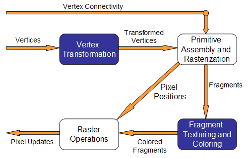
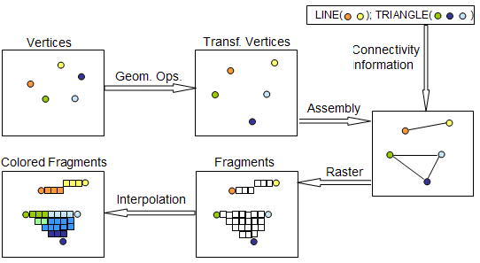

# 流水线概述

下图描述了一个简化的图形处理流水线，虽然简略但仍然可以展示着色器编程（shader programming）的一些重要概念。



一个固定流水线包括如下功能：

## 顶点变换

> Vertex Transformation

这里一个顶点是一个信息集合，包括空间中的位置、顶点的颜色、法线、纹理坐标等。这一阶段的输入是独立的顶点信息，固定功能流水线在这一阶段通常进行如下工作：

- 顶点位置变换。

- 为每个顶点计算光照。

- 纹理坐标的生成与变换。

## 图元组合和光栅化

> Primitive Assembly and Rasterization

此阶段的输入是变换后的顶点和连接信息（connectivity information）。连接信息告诉流水线顶点如何组成图元（三角形、四边形等）。此阶段还负责视景体（view frustum）裁剪和背面剔除。

光栅化决定了片断（fragment），以及图元的像素位置。这里的片断是指一块数据，用来更新帧缓存（frame buffer）中特定位置的一个像素。一个片断除了包含颜色，还有法线和纹理坐标等属性，这些信息用来计算新的像素颜色值。

本阶段的输出包括：

- 帧缓存中片断的位置。

- 在顶点变换阶段计算出的信息对每个片断的插值。

这个阶段利用在顶点变换阶段算出的数据，结合连接信息计算出片断的数据。例如，每个顶点包含一个变换后的位置，当它们组成图元时，就可以用来计算图元的片断位置。另一个例子是使用颜色，如果多边形的每个顶点都有自己的颜色值，那么多边形内部片断的颜色值就是各个顶点颜色插值得到的。

## 片断纹理化和色彩化

> Fragment Texturing and Coloring

此阶段的输入是经过插值的片断信息。在前一阶段已经通过插值计算了纹理坐标和一个颜色值，这个颜色在本阶段可以用来和纹理元素进行组合。此外，这一阶段还可以进行雾化处理。通常最后的输出是片断的颜色值以及深度信息。

## 光栅操作

> Raster Operations

此阶段的输入：

- 像素位置。

- 片断深度和颜色值。

在这个阶段对片断进行一系列的测试，包括：

- 剪切测试（scissor test）。

- Alpha 测试。

- 模版测试。

- 深度测试。

如果测试成功，则根据当前的混合模式（blend mode）用片断信息来更新像素值。注意混合只能在此阶段进行，因为片断纹理化和颜色化阶段不能访问帧缓存。帧缓存只能在此阶段访问。

## 一幅图总结固定功能流水线

> Visual Summary of the Fixed Functionality

下图直观地总结了上述流水线的各个阶段：



## 取代固定的功能

> Replacing Fixed Functionality

现在的显卡允许程序员自己编程实现上述流水线中的两个阶段：

- 顶点着色程序实现顶点变换阶段的功能。

- 片断着色程序替代片断纹理化和色彩化的功能。

## 顶点处理器

顶点处理器用来运行顶点着色程序。顶点着色程序的输入是顶点数据，即位置、颜色、法线等。

下面的 OpenGL 程序发送数据到顶点处理器，每个顶点中包含一个颜色信息和一个位置信息。

```
glBegin(...);
    glColor3f(0.2,0.4,0.6);
    glVertex3f(-1.0,1.0,2.0);
    glColor3f(0.2,0.4,0.8);
    glVertex3f(1.0,-1.0,2.0);
glEnd();
```

一个顶点着色程序可以编写代码实现如下功能：

- 使用模型视图矩阵以及投影矩阵进行顶点变换。

- 法线变换及归一化。

- 纹理坐标生成和变换。

- 逐顶点或逐像素光照计算。

- 颜色计算。

不一定要完成上面的所有操作，例如你的程序可能不使用光照。但是，一旦你使用了顶点着色程序，顶点处理器的所有固定功能都将被替换。所以你不能只编写法线变换的shader而指望固定功能帮你完成纹理坐标生成。

从上一节已经知道，顶点处理器并不知道连接信息，因此这里不能执行拓扑信息有关的操作。比如顶点处理器不能进行背面剔除，它只是操作顶点而不是面。

顶点着色程序至少需要一个变量：`gl_Position`，通常要用模型视图矩阵以及投影矩阵进行变换。顶点处理器可以访问 OpenGL 状态，所以可以用来处理材质和光照。最新的设备还可以访问纹理。

## 片断处理器

片断处理器可以运行片断着色程序，这个单元可以进行如下操作：

- 逐像素计算颜色和纹理坐标。

- 应用纹理。

- 雾化计算。

- 如果需要逐像素光照，可以用来计算法线。

片断处理器的输入是顶点坐标、颜色、法线等计算插值得到的结果。在顶点着色程序中对每个顶点的属性值进行了计算，现在将对图元中的每个片断进行处理，因此需要插值的结果。

如同顶点处理器一样，当你编写片断着色程序后，所有固定功能将被取代，所以不能使用片断着色程序对片断材质化，同时用固定功能进行雾化。程序员必须编写程序实现需要的所有效果。

片断处理器只对每个片断独立进行操作，并不知道相邻片断的内容。类似顶点着色程序，我们必须访问 OpenGL 状态，才可能知道应用程序中设置的雾颜色等内容。

一个片断着色程序有两种输出：

- 抛弃片断内容，什么也不输出。

- 计算片断的最终颜色 `gl_FragColor`，当要渲染到多个目标时计算 `gl_FragData`。

还可以写入深度信息，但上一阶段已经算过了，所以没有必要。

需要强调的是片断着色程序不能访问帧缓存，所以混合（blend）这样的操作只能发生在这之后。

---

[GLSL 图形流水线](http://blog.csdn.net/hgl868/article/details/7872100)
