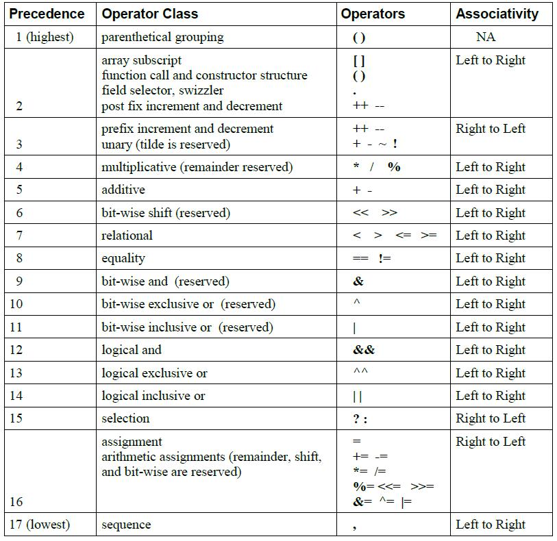
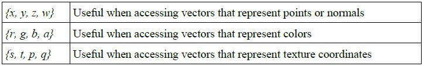
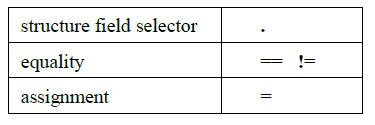

# GLSL 操作数

## 操作数

GLSL 包含如下操作符。



## 数组下标

数组元素通过数组下标操作符([ ])进行访问.这是操作数组的唯一操作符,举个访问数组元素的例子：

```
diffuseColor += lightIntensity[3] * NdotL;
```

## 函数调用

如果一个函数有返回值,那么通常这个函数调用会用在表达式中.

## 构造器

构造器使用函数调用语法，函数名是一个基本类型的关键字或者结构体名字，在初始化器或表达式中使用。参数被用来初始化要构造的值。构造器可以将一个数据标量类型转换为另一个标量类型，或者从较小的类型转换为较大的类型，或者从较大的类型转为较小的类型。

### 转换和标量构造器

标量之间转换：

```
int (bool)                         // 将布尔型值转换成整数
int (float)                        // 将浮点数值转换成整数
float (bool)                       // 将布尔型值转换成浮点数
float(int)                         // 将整型值转换成浮点数
bool(int)                          // 将整数值转换成布尔型值
bool(float)                        // 将浮点数值转换成布尔型值
```

当构造器将一个 `float` 转换成 `int` 时，浮点数的小数部分将被自动舍弃掉。

当 `int` 和 `float` 转换成 `bool` 时，0 和 0.0 被转换成 `false`，非 0 值将被转换成 `true`。当构造器将 `bool` 值转换成 `int` 或 `float` 时，`false` 被转换成 0 或 0.0，`true` 被转换成 1 或 1.0。

等价构造器,如float(float)也是合法的,但很少使用到。

如果构造器的参数不是标量，如向量，那么构造器将取其第一个元素。如 `float (vec3)` 构造器将取 `vec3` 中的第一个值。

### 向量和矩阵构造器

构造器也可以用来从标量集合,向量,矩阵中创建向量和矩阵.同时可以缩短向量长度。

如果使用一个单一的标量来初始化向量，那么向量的所有值均使用该值进行初始化。如果使用一个单一的标量来初始化矩阵，那么矩阵的对角线的所有元素均会被初始化为该值，但其他元素将会被初始化为0.0。

如果一个向量通过多个标量，向量或矩阵或这几种的混合来构造，那么向量的元素将按照参数列表的顺序来初始化。构造器将从参数列表中按从左到右的顺序去取参数,如果参数有多个值，那么再依次从这个参数中将值取出。构造矩阵也是类似的。矩阵元素将按照列为主要顺序来构造。构造器将依次从参数列表中取出参数值来构造矩阵的元素。如果参数列表中的值的个数超过矩阵或向量的元素个数的话，将会引起错误。

如果使用一个矩阵来构造矩阵的话,那么，参数矩阵中的元素值将放置到新矩阵的相应位置。

如果基本类型 `int`，`float`，`bool` 作为参数传进构造器，但是要构造的元素类型和传进来的数据类型不同，那么将会使用类型转换。

```
vec3(float)                             // initializes each component of with the float
vec4(ivec4)                             // makes a vec4 with component-wise conversion
vec2(float, float)                      // initializes a vec2 with 2 floats
ivec3(int, int, int)                    // initializes an ivec3 with 3 ints
bvec4(int, int, float, float)           // uses 4 Boolean conversions
vec2(vec3)                              // drops the third component of a vec3
vec3(vec4)                              // drops the fourth component of a vec4
vec3(vec2, float)                       // vec3.x = vec2.x, vec3.y = vec2.y, vec3.z = float
vec3(float, vec2)                       // vec3.x = float, vec3.y = vec2.x, vec3.z = vec2.y
vec4(vec3, float)
vec4(float, vec3)
vec4(vec2, vec2)

vec4 color = vec4(0.0, 1.0, 0.0, 1.0);
vec4 rgba = vec4(1.0);                  // sets each component to 1.0
vec3 rgb = vec3(color);                 // drop the 4th component

mat2(float)
mat3(float)
mat4(float)

mat2(vec2, vec2);
mat3(vec3, vec3, vec3);
mat4(vec4, vec4, vec4, vec4);

mat2(float, float,
     float, float);

mat3(float, float, float,
     float, float, float,
     float, float, float);

mat4(float, float, float, float,
     float, float, float, float,
     float, float, float, float,
     float, float, float, float);
```

### 结构体构造器

一旦结构体被定义，并给了一个类型名,那么和其同名的构造器就可以使用了。

```
struct light {
    float intensity;
    vec3 position;
};
light lightVar = light(3.0, vec3(1.0, 2.0, 3.0));
```

传进构造器的参数必须和结构体里面声明的具有相同的顺序和类型。

结构体构造器可以用于初始化器或者用在表达式中。

## 向量组件

向量中每个组件的名称都使用一个单独的字符来表示。常用的位置，颜色，或者纹理坐标向量的组件直接和几个便利的数字相关联。访问向量中的组件可以使用向量名(.)组件名的方式。

支持的组件名称如下：



组件名称 `x`，`r`，`s` 在向量中是表示同一个组件的同义词。

> 注意，为了不和颜色向量中的 `r` (红色)混淆，纹理向量中的第三个组件名称使用了 `p`。

访问超出向量个数的组件会引起错误:

```
vec2 pos;
pos.x                                      // is legal
pos.z                                      // is illegal
```

组件选择语法可以一次选择多个组件：

```
vec4 v4;
v4.rgba;                                  // is a vec4 and the same as just using v4,
v4.rgb;                                   // is a vec3,
v4.b;                                     // is a float,
v4.xy;                                    // is a vec2,
v4.xgba;                                  // is illegal - the component names do not come from
                                          // the same set.
```

通过移动和替换组件可以产生不同的向量：

```
vec4 pos = vec4(1.0, 2.0, 3.0, 4.0);
vec4 swiz= pos.wzyx;                    // swiz = (4.0, 3.0, 2.0, 1.0)
vec4 dup = pos.xxyy;                    // dup = (1.0, 1.0, 2.0, 2.0)
```

组件组符号可以出现在左值中，也可以出现在右值中。

```
vec4 pos = vec4(1.0, 2.0, 3.0, 4.0);
pos.xw = vec2(5.0, 6.0);                        // pos = (5.0, 2.0, 3.0, 6.0)
pos.wx = vec2(7.0, 8.0);                        // pos = (8.0, 2.0, 3.0, 7.0)
pos.xx = vec2(3.0, 4.0);                        // illegal - 'x' used twice
pos.xy = vec3(1.0, 2.0, 3.0);                   // illegal - mismatch between vec2 and vec3
```

数组下标索引语法同样适用于向量。所以：

```
vec4   pos;
pos[2] == pos.z;
```

`pos[2]` 表示第三个元素，与使用 `pos.z` 是等价的。

## 矩阵组件

访问矩阵组件可以使用数组的下标索引语法。使用一维数组访问矩阵表示你要访问矩阵中对应的那一列组件，即返回相应列所有元素的向量。二位数组才是具体的访问某一个组件。由于矩阵是列优先的，因此，使用数组来索引矩阵元素的时候，数组的第一维表示列，第二维表示行。

```
mat4 m;
m[1] = vec4(2.0);                    // sets the second column to all 2.0
m[0][0] = 1.0;                       // sets the upper left element to 1.0
m[2][3] = 2.0;                       // sets the 4th element of the third column to 2.0
```

如果下标越界，将引起编译时错误。 

## 结构体和字段

结构体字段的访问也是要用到点操作符的（.）。

可用于结构体的操作有如下几种：



等于和赋值运算符只有两个操作数类型是同一个结构体时才有意义。即使两个结构体的名称和字段一模一样，他们也不是相等的。包含矩阵和采样器类型的结构体的赋值和等于操作是未定义的。

```
Struct S {int x;};
S a;
{
    struct S {int x;};
    S b;
    a = b;                 // error: type mismatch
}
```

## 赋值

赋值表达式结构如下：

```
lvalue-expression = expression;
```

`lvalue-expression` 表示左值表达式，通过赋值运算符 `=` 将 `expression` 表达式的值赋给 `lvalue-expression;` 表达式和左值拥有相同的类型才会编译。所有的类型转换都必须显示地通过构造器来指定。左值必须是可写的。

- 支持 `+=` 、 `-=` 、 `*=` 、` /=` 等运算符。

- 保留 `%=` 、`<<=` 、` >>=`、` |=`和 `^=` 等运算符以便后面修订用。

- 读取一个未被写入或初始化的变量是合法的，但其值是未定义的。

## 表达式

在着色语言中表达式由以下方式创建：

- `bool`，`int`，`float` 型常量，所有向量类型，所有矩阵类型。

- 所有类型的构造器。

- 所有类型的变量名，除了不跟下标的数组名外。

- 带下标的数组名。

- 不带下标的数组名。一般只用在函数参数传递中。

- 带返回值的函数调用。

- 组件字段选择器和数组下标返回值。

- 括号表达式。任何表达式都可以是括号表达式。

- 二进制运算符 `+`、`-`、`*`、 `/`。

- `%` 保留修订用。

- 一元负操作符（`-`），自加（`++`），自减（`--`）操作符。

- 比较运算符。大于 `>`，小于 `<`，大于等于 `>=`，小于等于 `<=`。如果想比较向量，使用内建函数`lessThan`，`lessThanEqual`，`greaterThan`，`greaterThanEqual`。

- 等于 `=` 和不等于 `!=` 运算符。除了数组，包含数组的结构体，采样器，包含采样器的结构体外其他类型都可以使用。如果想让组件按位比较，使用内建的函数 `equal` 和 `notEqua`l。

- 逻辑二进制运算符`&&`，`||`，`^`。

- 逻辑一元运算符非 `!`。

- 逗号运算符。逗号运算符返回表达式序列中最后一个的结果。

- 三元选择运算符 `? :`。

- 运算符 `&`，`|`，`^`，`~`，`>>`，`<<` 保留修订用。

## 常量表达式

常量表达式可以是以下几种：

- 字符值如 5 或 `true`。

- 全局或本地使用 `const` 修饰的变量，函数参数除外。

- 返回常量数组，常量矩阵的某个元素或常量结构体的某个字段。

- 参数都是常量表达式的结构体。

- 所有参数都是常量表达式的内建函数类型，除了纹理查找函数外。

以下不能用在常量表达式：

- 用户自定义的函数。

- `uniform`，`attribute`，`varying` 变量。

数组变量不能使常量表达式，因为常量必须在声明时进行初始化，但是数组没有初始化机制。

## 向量和矩阵操作

对矩阵和向量操作就是对向量和矩阵的每一个单独组建进行操作。举个例子

1. 向量和一个浮点数或整数相加，结果是向量的每一个元素都和该浮点数相加。
    
    ```
    vec3 v, u;
    float f;
    v = u + f;
    ```

    等价于:

    ```
    v.x = u.x + f;
    v.y = u.y + f;
    v.z = u.z + f;
    ```

2. 向量和向量相加，结果是两个向量的对应位置的组件分别相加。

    ```
    vec3 v, u, w;
    w = v + u;
    ```

    等价于：

    ```
    w.x = v.x + u.x;
    w.y = v.y + u.y;
    w.z = v.z + u.z;
    ```

3. 这对于大部分操作符和所有的整数、浮点数向量和矩阵类型都是类似的操作。例外是矩阵和向量的乘法，矩阵和矩阵的乘法。

    如：向量乘以矩阵，结果是

    ```
    vec3 v, u;
    mat3 m;
    u = v * m;
    ```

    等价于：

    ```
    u.x = dot(v, m[0]); // m[0] is the left column of m
    u.y = dot(v, m[1]); // dot(a,b) is the inner (dot) product of a and b
    u.z = dot(v, m[2]);
    ```

4. 矩阵乘以向量，结果是矩阵的各行和向量相乘。

    ```
    u = m * v;
    ```

    等价于：
    
    ```
    u.x = m[0].x * v.x + m[1].x * v.y + m[2].x * v.z;
    u.y = m[0].y * v.x + m[1].y * v.y + m[2].y * v.z;
    u.z = m[0].z * v.x + m[1].z * v.y + m[2].z * v.z;
    ```

5. 矩阵乘以矩阵，前一个矩阵的行乘以后一个矩阵的列。

    ```
    mat m, n, r;
    r = m * n;
    ```

    等价于：

    ```
    r[0].x = m[0].x * n[0].x + m[1].x * n[0].y + m[2].x * n[0].z;
    r[1].x = m[0].x * n[1].x + m[1].x * n[1].y + m[2].x * n[1].z;
    r[2].x = m[0].x * n[2].x + m[1].x * n[2].y + m[2].x * n[2].z;
    r[0].y = m[0].y * n[0].x + m[1].y * n[0].y + m[2].y * n[0].z;
    r[1].y = m[0].y * n[1].x + m[1].y * n[1].y + m[2].y * n[1].z;
    r[2].y = m[0].y * n[2].x + m[1].y * n[2].y + m[2].y * n[2].z;
    r[0].z = m[0].z * n[0].x + m[1].z * n[0].y + m[2].z * n[0].z;
    r[1].z = m[0].z * n[1].x + m[1].z * n[1].y + m[2].z * n[1].z;
    r[2].z = m[0].z * n[2].x + m[1].z * n[2].y + m[2].z * n[2].z;
    ```

---

[OpenGL ES着色器语言之操作数](http://blog.csdn.net/hgl868/article/details/7846364)