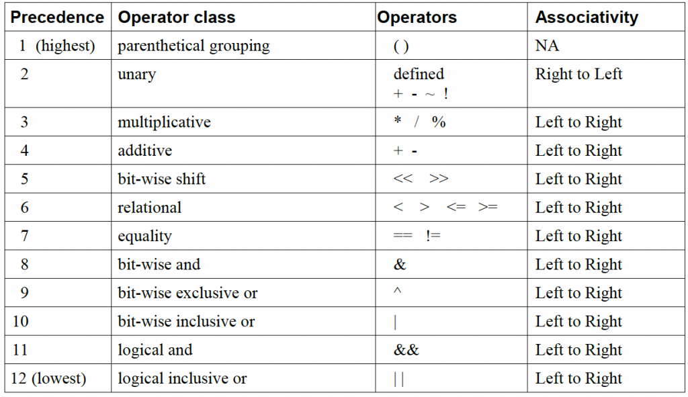

# GLSL 文法

首先明白 GLSL 是 OpenGL 的一部分，不能独立于 OpenGL。属于符合 OpenGL 标准接口的框架的 DSL。

> OpenGL 与 OpenGL ES 是有区别的。

## 字符集

OpenGL ES 着色语言的源字符集是ASCII编码的一个子集，包含以下字符：

- 字符 a-z, A-Z, and下划线 ( _ )。

- 数字 0-9。

- 点 (.)，加号(+)，分割线(-)，斜线(/)，星号(*)，百分号(%)，大于小于号 (< and >)，方括号 ( [ and ] )，小括号 ( ( and ) )，大括号( { and } )，插入符号(^)，竖线 ( | )，and(&)，波浪号(~)，等于号(=)，叹号 (!)，冒号(:)，分号(;)，逗号(,)，问号 (?)。

- 井号 (#)用作预处理器。

- 空格：空格字符，水平制表符，垂直制表符，换页符，回车符，换行符。

- 行连接符（\）不是语言的一部分。

总之，语言使用的这个字符集都是大小写敏感的。没有字符和字符串类型，因此字符集中不包含引号。也没有文件结束符。编译器通过字符串长度判断字符串结束，而不是通过特定的字符判断。

## 源字符串

一个着色器的源是一个由字符集中字符构成的字符串的数组。着色器通过这些字符串连接而成。每个字符串可以跨越多行。单行可以包含多个字符串。

一般在一个 OpenGL Surface 中，可以出现一个顶点着色器和一个片段（片元）着色器。

~~在这个版本的着色语言中，仅一个顶点着色器和一个片元着色器可以链接在一起。~~


## 编译的逻辑阶段

因为 GLSL 是 OpenGL 的 DSL，和大多数 DSL 一样，需要进行编译，与宿主语言联合在一起。

编译处理是基于标准C++的一个子集。顶点和片元处理器的编译单元在编译的最后阶段——链接之前是分开处理的。编译的逻辑阶段如下：

1. 源字符串链接。

2. 源字符串被转换成预处理符号序列。这些符号包括预处理数字，标示符和操作符。注释被替换成一个空格，而换行符保留。

3. 预处理器执行。

4. GLSL ES 语法解析转换后的符号。

5. 链接 uniform, verying, fixed 功能变量。

## 预处理器

```
#define
#undef 

#if
#ifdef
#ifndef 
#else
#elif
#endif

#error
#pragma 

#extension 
#version

#line 
```

`__LINE__` 行号。

`__FILE__` 文件名。

`__VERSION__` 版本号。

GL_ES 值为1，表示使用的是 OpenGL ES 渲染语言。

defined操作符的用法：

```
defined identifier
defined ( identifier )
```
将诊断信息保存到着色器对象的信息日志中

```
#error                
```

允许实现从属的编译控制。#pragma后面的符号不是预处理宏定义扩展的一部分。如果 `#pragma` 后面的符号无法识别，那么将忽略这个 `#pragma`。

可以使用的 `pragma` 如下：

```
// STDGL pragma 是预留的 pragma，用来将来的语言修订。如果没有这个宏的实现将使用以其开头的宏定义
#pragma STDGL        

// 用来开启和关闭开发和调试着色器的优化操作，默认情况下，所有的着色器的优化操作都是开启的，它只能在函数定义的外部使用。

#pragma optimize(on)
#pragma optimize(off)          

// 编译和注释一个着色器，并输出调试信息，因此可以用作一个调试器。只能用在函数外部，默认是关闭的。
#pragma debug(on)
#pragma debug(off)              
```

返回当前着色语言的版本号

```
#version number
```

默认情况下，着色语言编译器必须发布编译时句法、文法和语义错误。任何扩展的行为必须被首先激活。控制编译器扩展行为的指令是 `#extension`：

```
#extension extension_name : behavior
#extension all :: behavior
```

`extension_name` 是扩展的名称，在这个说明文档中并没有录入。符号 `all` 意味着行为作用于编译器支持的所有扩展。`behavior` 的值如下：`require`，`enable`，`warn`，`disable `。

操作符的优先级和结合性：



## 注释

```
    /*    注释一个模块   */
    // 注释一行
```

## 符号

着色语言是一个符号序列，可以包含以下符号：

关键字， 标示符， 整型常量， 浮点型常量， 操作数。

## 关键字

以下是着色语言已经在使用的关键字：     
                        
`attribute` `const` `uniform` `varying` 

`break` `continue` `do` `for` `while`

`if` `else`

`in` `out` `inout`

`float` `int` `void` `bool` `true` `false`

`lowp` `mediump` `highp` `precision` `invariant`

`discard` `return`

`mat2` `mat3` `mat4`

`vec2` `vec3` `vec4` `ivec2` `ivec3` `ivec4` `bvec2` `bvec3` `bvec4`

`sampler2D` `samplerCube`

`struct`

以下是保留关键字：

`asm`

`class` `union` `enum` `typedef` `template` `this` `packed`

`goto` `switch` `default`

`inline` `noinline` `volatile` `public` `static` `extern` `external` `interface` `flat`

`long` `short` `double` `half` `fixed` `unsigned` `superp`

`input` `output`

`hvec2` `hvec3` `hvec4` `dvec2` `dvec3` `dvec4` `fvec2` `fvec3` `fvec4`

`sampler1D` `sampler3D`

`sampler1DShadow` `sampler2DShadow`

`sampler2DRect` `sampler3DRect` `sampler2DRectShadow`

`sizeof` `cast`

`namespace` `using`

## 标识符

标识符用作变量名， 函数名， 结构体名和域选择器名（选择向量和矩阵的元素，类似结构体域）。标识符命名规则：

1. 不能以数字开头， 只能以字母和下划线开头。

2. 不能以 **gl_** 开头，这是被 OpenGL 预留的。

---

参考自[OpenGL ES着色器语言之着色](http://blog.csdn.net/hgl868/article/details/7846238)
